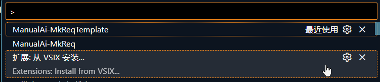
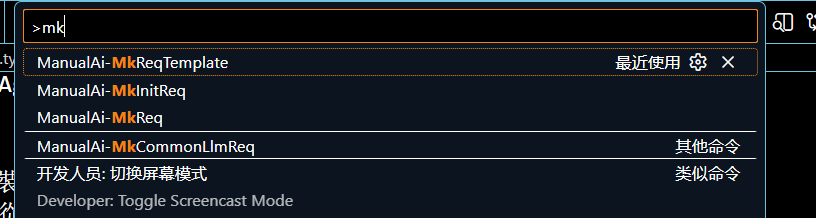
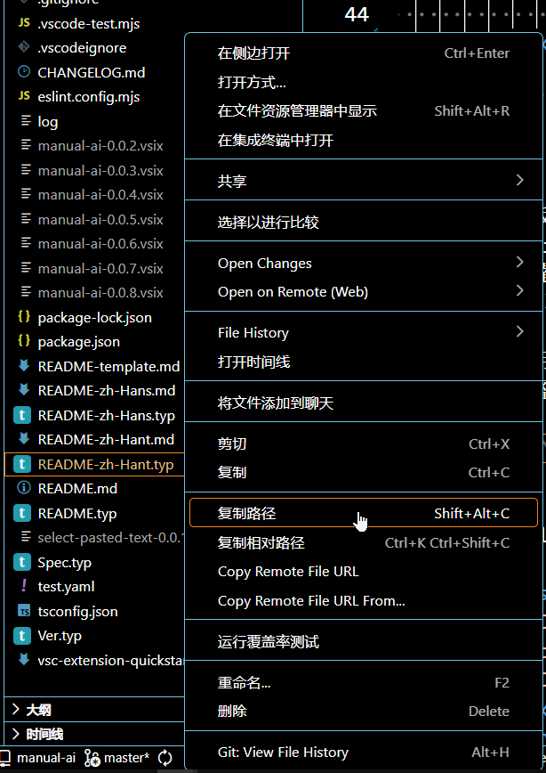

Manual-AI 是一款 VSCode 扩展。通过结构化的 YamlMd 数据交互, 用户能利用网页上的AI大模型, 使大模型与编辑器结合㕥执行修改代码等操作, 达到近似AI Agent的编程体验。

## 扩展概述

现有 VSCode 集成 AI 编程方案（使用插件自带模型、自行配置第三方 API 金钥）多需付费；而网页版 AI 多提供免费交互，但缺乏与 VSCode 编辑器的结构化交互能力。该插件弥补这一缺口，让用户无需付费即可借助免费网页 AI 实现近似 AI Agent 的编程体验。

## 安装扩展

### 从vsix安装

按`Ctrl+Shift+P`:然后选择vsix路径

可从github release区寻找有无打包好的vsix

## 快速上手

1. 安装扩展
2. 生成用户输入模板
   1. 按`Ctrl+N`、创建一个临时文件
   2. 按`Ctrl+Shift+P`, 输入`ManualAi-MkReqTemplate`, 回车执行命令, 这会生成 供用户输入的yaml模板, 并将其写入剪贴板, 然后您需按`Ctrl+V`把模板粘贴到当前临时文件中
      
3. 编辑模板
   需要在files中添加文件上下文。支持添加绝对路径, 带通配符的绝对路径, 正则表达式匹配文件上下文, 并自动读取带行号的文件内容 注意: **不支持相对路径!**
   您可使用Vscode快捷键 Shift+Alt+C 或使用右键菜单方便地复制当前文件的绝对路径，避免手动输入
   例
   ````md
   ```yaml
   files:
     paths: #所有路径都须为绝对路径。
       - C:/MyProj/src/xxx.ts # 单个文件
       - c:\MyProj\src\xxx.ts # 支持小写盘符与反斜杠路径分隔符
       - C:/MyProj/src/services/* #支持通配符
     regex: # 正则表达式匹配文件上下文
       - rootDir: - C:/MyProj/src/ #指定正则表达式搜索的根目录
         includes: # 包含
           - .*\.ts$
         excludes: # 排除
           - .*\.js$
   text: *__text # 用自然语言描述的提示词, 写在下面 markdown 一级标题 # __text下面的代码块中
   ```
   # __text
   ```
   修改上面文件的编译错误
   ```
   ````
4. 生成请求文本
   先把上一步编辑的yaml请求的全文复制到剪贴板中, 然后执行`ManualAi-MkInitReq`命令、这将生成 面向大模型的请求文本 并 将最终的请求文本写入剪贴板。生成的文本中会带上系统提示词。
   默认的系统提示词会要求大模型以约定的yaml格式输出, 㕥便后续程序解析
   如果您不需要带上系统提示词，则使用`ManualAi-MkReq`命令, 这种情况适用于在同一会话中追问, 即大模型已看过系统提示词
   生成的请求文本 会带上 所有文件上下文的文件内容, 并附上 行号 与 从vscode api中获取到的错误诊断
5. 将请求文本发给大模型 在网页中打开大模型, 粘贴, 发送, 等待回复
6. 执行大模型操作 复制下大模型的响应文本到剪贴板，并执行`ManualAi-ExeOp`命令，扩展会解析响应文本，执行对应的写操作。 **在执行操作之前, 强烈建议您做好版本控制和备份** 如先git commit一次

## 提示词配置

`<用户家目录>/.ManualAi/Io/SysPrompt`为系统提示词, 您可以自行修改。

- 执行`ManualAi-MkInitReq`时 会带上系统提示词
- 执行`ManualAi-MkReq`则不带上系统提示词

## 待实现功能

### 在 大模型响应中 支持 与读取文件相关的操作类型

1. readFiles
2. seekDef

### 从选中区域便捷生成请求文本

当前您可以配合使用 `Copy With Line Numbers` 插件 达到近似效果

## 从源码构建

```bash
npm i
vsce package
```

输出产物在项目根目录

## YamlMd 格式

YamlMd是一种markdown与yaml结合的写法, 便于在yaml中结合无需额外缩进与转义的多行文本块, 可轻松解析为yaml格式

例:

````md
```yaml
name: Tsinswreng
descr: *__content1
```

# __content1
```
aaa
111
```
````

上面的YamlMd解析成yaml后为:

```yaml
__content1: &__content1 |+
  aaa
  111

name: Tsinswreng
descr: *__content1
```

此扩展要求大模型使用此格式输出响应。具体格式规范可参考

- [默认系统提示词(typst版)](Prompt/Prompt.typ)
- [默认系统提示词(markdown版, 由typst版转换生成)](Prompt/Prompt.md)
